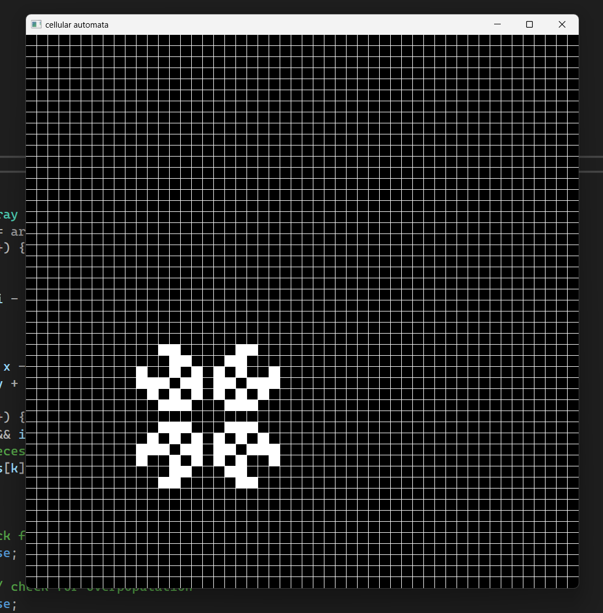

# cellular-automata
In this project I have implemented Conway's game of life. 
I used SFML and C++ to do this. 
Other cellular automata rules can be implemented in the same repository by adjusting `update` function. 

